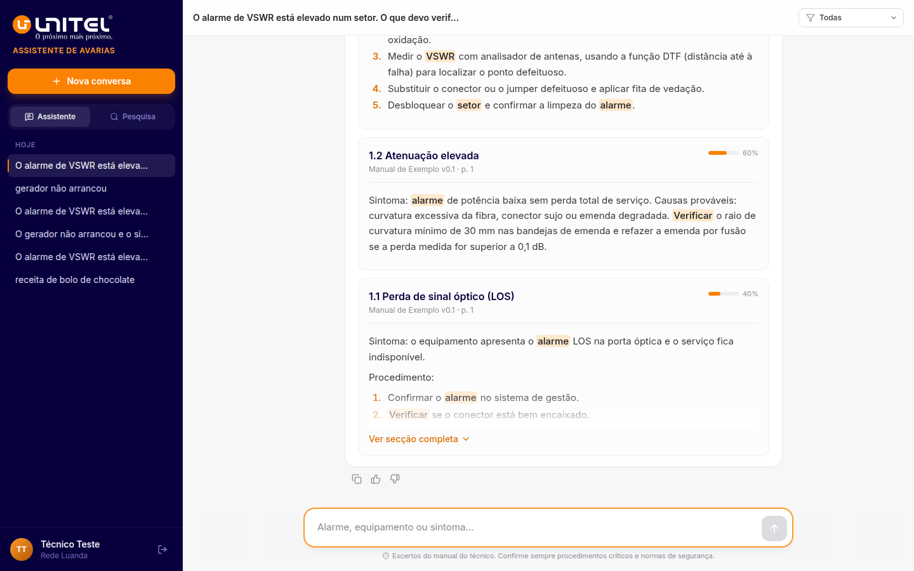

# ARA — Assistente de Avarias (Unitel)

PoC de assistente para apoio à resolução de avarias na manutenção de rede, com base no manual do técnico. Mostra sempre a secção e a página.

## Modos

| | IA desligada (atual) | IA ligada, só chave Claude | IA ligada, chaves Claude + Voyage |
|---|---|---|---|
| Pesquisa | Palavras-chave em português (sem acentos, radicais) | Palavras-chave | Por significado (Voyage + pgvector) |
| Resposta | Secções do manual, com os termos destacados | Texto escrito pelo Claude, com citações | Texto escrito pelo Claude, com citações |
| Serviços externos | Nenhum | Anthropic | Anthropic + Voyage |

**Ligar/desligar a IA:** administrador → botão **IA** no cabeçalho → interruptor. Aplica-se logo a todos, sem reiniciar, e fica guardado.

1. Pôr a chave no servidor, em `backend/.env`: `ANTHROPIC_API_KEY=sk-ant-…` (e opcionalmente `VOYAGE_API_KEY=…`) → `pm2 restart ara-api`.
2. Na aplicação: botão **IA** → **Testar ligação** → ligar o interruptor.

- As chaves nunca saem do servidor (o painel só mostra se existem).
- Se o Claude falhar (chave inválida, sem crédito, sem rede), o técnico recebe os excertos do manual com um aviso, em vez de um erro.
- Com a chave Voyage, ao ligar a IA os embeddings dos manuais já carregados são gerados em segundo plano (progresso no painel); até terminarem, a pesquisa continua por palavras-chave.



## Estrutura

```
backend/    Fastify + Prisma + pgvector + Claude API
  src/services/chunker.ts     PDF → chunks por secção (Sprint 1)
  src/services/retrieval.ts   pesquisa: palavras-chave (sem IA) | semântica (com IA)
  src/services/embeddings.ts  Voyage AI (só com IA)
  src/services/llm.ts         system prompt + Claude em streaming (só com IA)
  src/routes/                 auth, search, chat (SSE), conversas, feedback
frontend/   React 18 + Vite + Tailwind v4 (Sprint 4)
deploy/     PM2 + Nginx para o VPS
```

## Arranque local

Requisitos: Node 20+, Postgres 16 com `pgvector` (ou `docker compose up -d`).

```bash
# Backend
cd backend
cp .env.example .env          # definir JWT_SECRET (as chaves de IA só são precisas com AI_ENABLED=true)
npm install
npm run db:migrate
npm run user:create -- jsilva 'PalavraPasse123' "João Silva" --section "Rede Luanda"
npm run ingest -- ../manuais/manual-tecnico.pdf --title "Manual do Técnico" --version 1.0
npm run dev                   # http://localhost:3000

# Frontend
cd ../frontend
npm install
npm run dev                   # http://localhost:5173 (proxy /api → :3000)
```

Há um PDF fictício para testes em `backend/fixtures/manual-exemplo.pdf`.

## Vídeos

Separador **Biblioteca → Vídeos** (administradores): carregar MP4 (recomendado), WebM ou MOV, até 500 MB, com **título** e descrição opcional.

- A pesquisa encontra o vídeo pelo **título** (peso maior) e pela descrição, com as mesmas regras do manual (sem acentos, variações das palavras).
- No chat, os vídeos relacionados aparecem no topo da resposta; abrem num leitor dentro da aplicação (avançar/recuar suportado).
- Os ficheiros ficam no VPS em `VIDEO_DIR` (por omissão `backend/storage/videos`) — incluir nos backups.
- Formato recomendado: **MP4 (H.264 + AAC)**, que reproduz em todos os navegadores. O MOV pode não reproduzir no Chrome/Android.

## Ver página no manual (imagens e esquemas)

A pesquisa usa só o **texto** do PDF; imagens, esquemas e tabelas digitalizadas não são lidos. Para os consultar, cada secção encontrada (chat e Pesquisa) tem o botão **Ver página**, que abre a **página original** do PDF dentro da aplicação, já na página da secção, com navegação e zoom.

- O PDF é desenhado no navegador (pdf.js, carregado só quando se abre uma página) e lido **por partes**: só descarrega o necessário (importante nos dados móveis).
- O PDF original é guardado em `DOCUMENT_DIR` (por omissão `backend/storage/manuals`) — incluir nos backups.
- Manuais carregados antes desta funcionalidade aparecem em **Biblioteca → Manuais** como “Sem PDF original — recarregar”: basta carregar o mesmo PDF com o mesmo título e versão.

## Carregar manuais

**Pela interface (recomendado):** entrar com um utilizador administrador → separador **Biblioteca → Manuais** → arrastar o PDF, indicar título e versão → **Carregar manual**. O progresso é mostrado por etapas; no fim aparece o número de páginas e secções indexadas.

- Reenviar o mesmo título + versão substitui o manual anterior; uma versão nova fica ao lado.
- Só PDF com texto selecionável (PDF digitalizado precisa de OCR antes), máx. 100 MB.
- Criar administrador: `npm run user:create -- admin 'PalavraPasse123' "Nome" --admin`

**Pela linha de comandos (no servidor):** `npm run ingest -- manual.pdf --title "Manual do Técnico" --version 1.0`

## Testar a pesquisa

```bash
npm run search -- "alarme VSWR elevado" 5
```
Ou no separador **Pesquisa** da interface.

## API

| Método | Rota | Descrição |
|---|---|---|
| POST | `/api/auth/login` | `{username, password}` → `{token, user}` |
| GET | `/api/health` | `{mode: "pesquisa" \| "ia"}` |
| GET | `/api/search?q=&topK=&category=` | pesquisa direta no manual |
| POST | `/api/chat` | `{question, conversationId?, category?}` → SSE (`meta`, `delta`, `done`, `error`); sem IA devolve os excertos |
| GET/DELETE | `/api/conversations[/:id]` | histórico do técnico |
| GET | `/api/documents` | manuais carregados |
| POST | `/api/documents` | (admin) multipart `title`, `version`, `file` → `202 {job}` |
| GET | `/api/documents/jobs/:id` | (admin) progresso da ingestão |
| DELETE | `/api/documents/:id` | (admin) apaga o manual e as secções |
| GET / PUT | `/api/settings/ai` | (admin) estado da IA / ligar-desligar `{enabled}` |
| POST | `/api/settings/ai/test` | (admin) testar as chaves (Claude sem custo; Voyage 1 pedido mínimo) |
| GET | `/api/chunks/:id/page` | manual, página e URL do PDF de uma secção ("Ver página") |
| GET | `/api/documents/:id/file?t=` | PDF original (Range); token assinado, válido 6 h |
| GET | `/api/videos` | vídeos (com URL de reprodução temporário) |
| POST | `/api/videos` | (admin) multipart `title`, `description?`, `durationSec?`, `file` |
| PATCH / DELETE | `/api/videos/:id` | (admin) editar título/descrição / apagar |
| GET | `/api/videos/:id/stream?t=` | reprodução (Range); token assinado, válido 6 h |
| POST | `/api/messages/:id/feedback` | `{rating: 1 \| -1 \| null}` — usado na validação (Sprint 5) |

## Deploy (VPS, fora da rede Unitel)

Guia completo, passo a passo, em `deploy/DEPLOY.md`. Requisitos do servidor em `deploy/requirements.txt`. Resumo:

```bash
cd backend && npm ci && npm run build && npm run db:migrate
cd ../frontend && npm ci && npm run build   # copiar dist/ para /var/www/ara/frontend/dist
pm2 start deploy/ecosystem.config.cjs
```
Nginx: ver `deploy/nginx.conf` (inclui `proxy_buffering off` para o streaming). As fontes são servidas localmente (sem Google Fonts), porque a rede Unitel bloqueia domínios externos.

## Identidade visual

Logótipo Unitel em `frontend/public/` (completo, versão branca e símbolo). Cores amostradas do logótipo, em `frontend/src/index.css`: laranja `#FB8100` (`--color-brand-*`) e azul-marinho `#08003C` (`--color-navy-*`).
